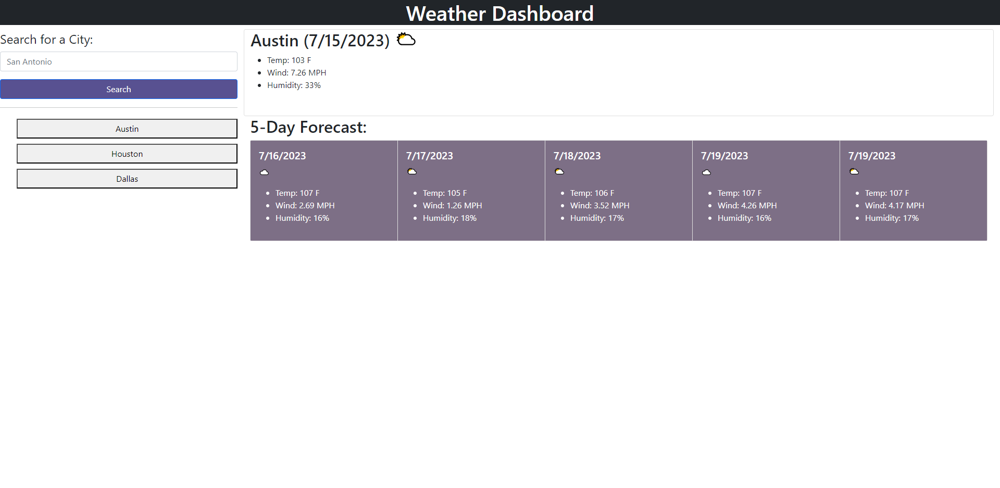

# Weather-Dashboard

## Description
This webpage allows users to search and view any city's weather data for the current date and for 5 days forward. Each city the user searches is stored in local storage and once the page is refreshed, displayed in the left-hand list for the user to access its data again upon clicking. Data includes city name, date, temperature, wind, humidity, and an icon representing the weather conditions.

## Credit
Thank you to my classmates; Lucas Wysoczanski, Daniel Lee, May Pham, and Joey Lee; for partnering with me to work on this challenge. Here are their GitHub profiles--
Lucas Wysoczanski: https://github.com/LucasWyski001
Daniel Lee: https://github.com/drog41813
May Pham: https://github.com/mayphamx
Joey Lee: https://github.com/Rockojoe2

## Usage

https://micavilla.github.io/weather-dashboard/